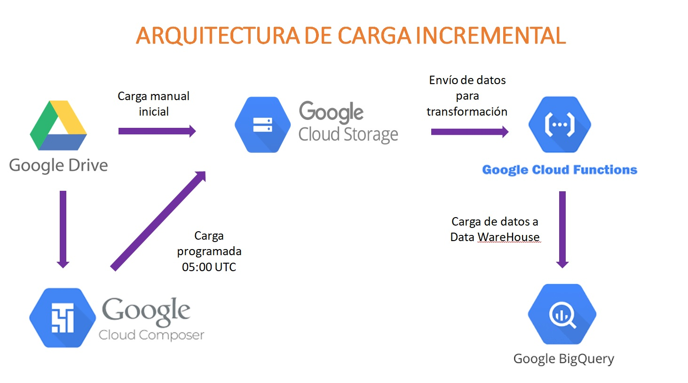

# DataSolution

## Descripción del Proyecto

El proyecto DataSolution se enfoca en la implementación de una solución de análisis de datos para procesar, limpiar y visualizar conjuntos de datos alojados en Google Drive. Utilizaremos los recursos de Google Cloud Platform (GCP) para realizar estas tareas de manera eficiente y escalable.

## Recursos Utilizados

### Google Drive

Utilizaremos Google Drive como fuente inicial de los conjuntos de datos. Estos conjuntos de datos contendrán la información que se utilizará para realizar análisis y generar informes.

### Google Cloud Storage

Utilizaremos Google Cloud Storage (GCS) para almacenar los conjuntos de datos de forma escalable y duradera. Los datos se cargarán en GCS de forma incremental a medida que se reciban nuevos conjuntos de datos.

### Google Cloud Composer

Google Cloud Composer se utilizará para orquestar y programar los flujos de trabajo de procesamiento de datos. Utilizaremos este servicio para automatizar la limpieza y transformación de los datos a través de flujos de trabajo definidos por código.

### Google Cloud Functions

Google Cloud Functions se utilizará para implementar funciones de procesamiento de datos en tiempo real o basadas en eventos. Estas funciones se utilizarán para manipular los datos de forma dinámica según sea necesario durante el procesamiento.

### Google BigQuery

Google BigQuery se utilizará como almacén de datos para almacenar los conjuntos de datos procesados y transformados. Utilizaremos BigQuery para realizar consultas analíticas complejas y generar informes a partir de los datos.

### Power BI

Power BI se utilizará para crear visualizaciones interactivas y paneles de control que permitan a los usuarios explorar y comprender los datos de manera intuitiva. Los informes generados en Power BI proporcionarán una interfaz de usuario amigable para interactuar con los datos analizados.

## Resumen

El proyecto DataSolution aprovecha los recursos de Google Cloud Platform para implementar una solución completa de análisis de datos. Desde la ingesta de datos desde Google Drive hasta su almacenamiento, procesamiento y visualización en Power BI, utilizaremos una combinación de servicios en la nube para ofrecer una solución robusta y escalable.

 
 
