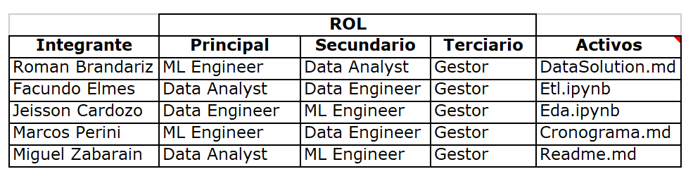

# 
PROYECTO FINAL REQUERIDO POR HENRY EN EL DESARROLLO DEL BOOTCAMP DE DATA SCIENCE

### 
GRUPO Nº4

### 
DS_FT-18

---

## Contexto
Uno de los datos más valiosos con que cuentan las empresas de hoy en día son las reseñas de usuarios de sus productos o servicios, y esto se debe a diversas razones fundamentales. En primer lugar, estas opiniones espontáneas y sinceras surgen naturalmente cuando la experiencia con el bien o servicio fue excepcionalmente positiva o, por el contrario, decepcionante. Este tipo de retroalimentación directa proporciona a las empresas una visión auténtica de la percepción que tienen los clientes sobre sus ofertas.

Un ejemplo destacado de plataformas que canalizan esta valiosa información son Yelp y Google Maps. En el caso de Yelp, usuarios de todo el mundo comparten sus vivencias en una variedad de negocios, desde restaurantes hasta servicios diversos. Las reseñas, al ser expresiones genuinas de experiencias personales, ofrecen a las empresas una comprensión profunda de cómo sus clientes interactúan con sus productos o servicios.

De manera similar, Google Maps integra una plataforma de reseñas donde los usuarios comparten sus impresiones sobre negocios y lugares. Este fenómeno se convierte en un recurso invaluable para las empresas, ya que los usuarios recurren a estas opiniones al planificar sus actividades, desde compras hasta decisiones sobre lugares donde comer o alojarse.

La relevancia de estas reseñas radica en su capacidad para proporcionar a las empresas una evaluación honesta de su desempeño y la percepción de los clientes. No solo sirven como indicadores clave de la calidad del servicio y la utilidad del local, sino que también señalan áreas específicas que podrían beneficiarse de mejoras. En última instancia, las reseñas de los usuarios se han convertido en una herramienta indispensable para la toma de decisiones estratégicas, permitiendo a las empresas adaptarse y mejorar continuamente para satisfacer las expectativas y necesidades cambiantes de su audiencia.

## Objetivos, Alcance y Entrgables del Proyecto

### Objetivo: 
Proporcionar al cliente -parte de un conglomerado de empresas de restaurantes y afines- un análisis de mercado en EEUU sobre hoteles y restaurantes, usando para ello las reseñas en Yelp y Google Maps. En resumen, el cliente quiere:
1. Un análisis detallado de la opinión de los usuarios en Yelp y Google Maps en torno a los sitios objeto de estudio.
2. Utilizando Machine Learning (ML), se requiere un análisis de sentimientos de las reseñas en torno a los sitios objeto de estudio, para predecir cuáles serán los rubros de los negocios que más crecerán (o decaerán).
3. Con base en 1 y 2, el cliente quiere saber dónde es conveniente emplazar los nuevos locales de restaurantes y afines.
4. Utilizando Machine Learning (ML), se requiere un sistema de recomendación de restaurantes para los usuarios de ambas plataformas.

### Alcance y entregables del proyecto: 
El proyecto gira en torno al estudio de las recomendaciones hechas por los usuarios de hoteles y restaurantes -en adelante, 'el usuario objetivo'-, y estará limitado por el alcance descrito a continuación:

1. Se analizarán datos relativos a las reseñas en Yelp y Google Maps hechas por el usuario objetivo en los Estados Unidos, limitando el estudio a los 5 Estados más poblados, con el fin de obtener una muestra representativa y significativa que por un lado, garantice datos suficientes para el entrenamiento de los modelos de ML, y por otro lado, refleje de manera precisa las preferencias y opiniones predominantes de la audiencia objetivo a nivel nacional.
2. Se creará un modelo de Machine Learning (ML1) para predecir cuáles serán los rubros de los negocios que más crecerán (o decaerán), información que será incluida en el informe presentado al cliente.
3. **Se entregará** un informe detallado basado en el análisis de los datos y las predicciones del modelo ML1, indicando al cliente, dónde es conveniente emplazar los nuevos locales de restaurantes y hoteles.
4. **Se entregará** un sistema de recomendación de restaurantes basado en ML(ML2).
5. **Se entregará** un dashboard interactivo en Power BI, para que el cliente tenga la posibilidad de explorar los datos a través de visualizaciones claras, que le puedan ayudar a obtener nuevos insights de valor. El Dashboard tendrá 5 KPIs.

#### IMPORTANTE: ####
La solución ofrecida al cliente no contempla la inclusión del sistema de recomendación de restaurantes en las plataformas de Yelp y google Maps, por cuanto nuestra compañía no es propietaria ni de las plataformas, ni de los sitios web donde estas están alojadas.

## Indicadores Clave de Desempeño (KPIs)
En esta sección se proporciona una perspectiva detallada sobre la calidad y rendimiento en el sector de hoteles y restaurantes. Este conjunto de KPIs está diseñado para brindar una visión estratégica que permita evaluar oportunidades de entrada al mercado.

### KPIs diseñados:

1. **Disminución Trimestral en la Calificación Promedio a establecimientos ajenos:**
   - Evalúa la disminución trimestral de 1 punto en la calificación promedio a establecimientos -de tipo hotel, o restaurante, o ambos- con respecto al trimestre anterior.

2. **Disminución Trimestral en el Porcentaje de Reseñas Positivas a establecimientos ajenos:**
   - Evalúa la disminución trimestral del 10% en el porcentaje de reseñas positivas a establecimientos -de tipo hotel, o restaurante, o ambos- frente al mismo trimestre del año anterior.

3. **Disminución Trimestral porcentual de Reseñas con 3 o Más Estrellas para establecimientos ajenos:**
   - Evalúa la disminución trimestral del 10% en reseñas con 3 o más estrellas para establecimientos -de tipo hotel, o restaurante, o ambos- frente al trimestre anterior.

4. **Aumento Trimestral en la Calificación Promedio a establecimientos propios:**
   - Evalúa el aumento trimestral de 1 punto en la calificación promedio a establecimientos -de tipo hotel, o restaurante, o ambos- con respecto al trimestre anterior.

Estos KPIs ofrecen una evaluación detallada de las experiencias de los usuarios, identificando áreas de oportunidad para mejorar la calidad en el sector de hoteles y restaurantes. El dashboard interactivo que se desarrollará con Power BI proporciona una herramienta visual poderosa para analizar estos indicadores y tomar decisiones informadas que puedan impulsar la entrada al mercado con productos y servicios de alta calidad.

## Planificación y Organización
En esta sección, abordaremos la metodología de trabajo que guía nuestro enfoque colaborativo. La coordinación efectiva, la asignación equitativa de tareas y el apoyo mutuo son pilares fundamentales para el éxito de nuestro equipo. La metodología propuesta, alineada con los principios ágiles de Scrum, simplifica las herramientas convencionales para una comunicación y planificación más efectivas en nuestros sprints.

### Metodología de trabajo
Esta sección responde la pregunta relacionada con lo que es tal vez el aspecto más crucial en el éxito de un trabajo colaborativo: ¿Cómo hacer para que los integrantes del equipo de trabajo puedan colaborar coordinados, repartiendo la carga de trabajo equitativamente, y apoyándose unos a otros?

Esta metodología se alinea con la filosofía Ágil de Scrum, pero simplifica las herramientas convencionalmente usadas para apoyar la comunicación y planeación del trabajo iterativo por Sprints.

#### ¿Qué problemas tiene un equipo cuando no trabaja coordinadamente?

Cuando un grupo de personas decide trabajar en grupo para desarrollar una solución software (data solutions incluidas) se enfrenta a los siguientes desafíos:

1. **Desafío #1:** Hay problemas de comunicación y dos integrantes terminan repitiendo código.
2. **Desafío #2:** Los problemas de comunicación hacen difícil a los integrantes del equipo saber cuáles son sus responsabilidades en el día a día.
3. **Desafío #3:** Se embarcan en el uso de herramientas tecnológicas que piensan solucionarán todos sus problemas y les permitirá trabajar coordinadamente y con fluidez, cuando en realidad tiende a complicarlo todo.
4. **Desafío #4:** Si, adicionalmente, los integrantes del equipo carecen de conocimiento y/o experiencia relativos al uso de GitHub y similares para colaboración, ni pensar en la idea de aprender a usar los Branches (ramas) porque por un lado, se perdería mucho tiempo aprendiendo e interiorizando el concepto; y por otro lado, se perdería mucho más tiempo solucionando los problemas y errores que sí o sí van a presentarse por la falta de experiencia en el uso de la tecnología.

#### ¿Cómo prepararse para enfrentar esos desafíos?

Lo mejor que se puede hacer es evitar ponerse en una situación que inexorablemente lleve a enfrentar alguno de ellos. La solución no está en las herramientas para la gestión del proyecto, sino en el proceso usado para dicha gestión. Existen muchos procesos que se pueden seguir para trabajar en grupo de forma apropiada, pero se propondrá un proceso propietario del grupo, que se cree puede ser más fácil de entender e implementar. Este proceso se apoya en los repositorios para trabajo colaborativo de GitHub.

#### El problema raíz, fuente de todos los desafíos descritos

Todos los problemas/desafíos descritos surgen por una razón elemental: la gestión del proyecto no gira en torno a los Activos del proyecto, sino que gira en torno a tareas, roles, y otros rubros no tan concretos.

Imaginemos al integrante del equipo llamado 'Miguel', con Rol Principal/Secundario/Terciario de Data Analyst/Data Scientist/Gestor respectivamente. ¿Qué es más fácil, decirle que está a cargo de los activos 'Dashboard.pbix', 'ModeloDeClasificacionXYZ.py', y 'Readme.md'; o decirle que está a cargo, junto con los integrantes 'Facu' y 'Román', de los aspectos de visualización del proyecto; así como que con 'Román', 'Marcos' y 'Jeison' debe ponerse de acuerdo para encargarse de los asuntos de DataScience relativos a ML?

#### La solución gira en torno a identificar los documentos que son Activos del proyecto

Un Activo del proyecto es un archivo, de tipo claramente definido (.md, .py, .ipynb, .xlsx, etc.).

Lo que diferencia a un Activo del proyecto de otro archivo en el repositorio, es que es explícita o implícitamente exigido por los requerimientos del proyecto. Son ejemplo de Activos, los archivos 'Eda.ipynb', 'Etl.ipynb' y Dashboard.pbix.

#### Los items de los sprints

Los items de los sprints no son otra cosa que lo requerido explícita o implícitamente para adelantar exitosamente el sprint. El documento 'ItemsSprints' lista para cada sprint los requerimientos en cuestión, y frente a cada uno, el sprint al que pertenece, los Activos involucrados, el encargado (que no es otra cosa que el responsable del Activo para dicho Item de sprint) y sus colaboradores, que no tienen a cargo un Activo asociado al Item del sprint, pero ayudan al Encargado desarrollando parte del documento (texto o código) y colocándolo en la carpeta 'Colaboraciones' del repositorio, desde donde el Encargado los toma para elaborar el Activo.

#### Beneficios de incorporar el documento 'ItemsSprints' en la Metodología de Trabajo

1. Pone bajo control el 'Desafío #2', porque da claridad a los integrantes del grupo respecto a lo que se debe realizar. En las reuniones diarias con el HM de HENRY cada quien podrá exponer claramente que hizo el día anterior, qué hará ese día y dónde ha tenido problemas. Por ejemplo, el encargado del Activo 'Etl.ipynb', sabe exactamente qué debe contener ese archivo. Si no tiene claro algo, puede mirar los archivos similares de proyectos de otros grupos o los que anteriormente realizó en los proyectos individuales.

2. Da claridad respecto a qué items del Sprint se están atendiendo con la elaboración del Activo. Esto resulta conveniente en la presentación cuando se pregunte cómo fue atendido un item específico. En este caso, cada integrante del grupo sabrá cuándo debe intervenir, porque tiene claro a qué Item de Sprint apunta cada Activo a su cargo.

3. Cada encargado de un Activo tendrá una idea clara de lo que tiene y lo que le falta para completar su creación y podrá pedir ayuda al equipo para su compleción.

4. Ayuda a identificar los items no atendidos del Sprint.

5. Las responsabilidades del proyecto no se atomizan y evaporan. Por el contrario, están claramente definidas, y los encargados de los Activos sabrán que deben apurarse y/o pedir ayuda con tiempo para poder cumplir.

6. Pone bajo control el 'Desafío #1', porque el encargado del Activo es la única persona autorizada para modificarlo y hacer los respectivos commits que suben al repositorio GitHub los cambios hechos al Activo en su repo local. De esta forma, se minimiza el riesgo de código duplicado; y adicionalmente, se evita conflictos que usualmente surgen en una operación de 'git merge' o 'git rebase'.

7. Posibilita trabajar colaborativamente sin necesidad de agregar ramas al repositorio, trabajando solo con 'main'. Esto es posible porque cada miembro del equipo tiene en su repositorio local una carpeta 'Colaboraciones' donde pondrá en un archivo de texto, un fragmento de código o de texto que atiende lo solicitado por el encargado de un Activo. De esta manera, colabora con el encargado del Activo sin hacerle modificaciones al mismo, y así, en el commit y push que hace, sube al repositorio GitHub el único cambio que hizo, es decir, el archivo de texto en la carpeta 'Colaboraciones', cuyo contenido luego usará el encargado del Activo para incluirlo al mismo y actualizar el Activo en el repositorio con un commit.

8. La simpleza de esta metodología resuelve el 'Desafio #3' e indirectamente, el 'Desafío #4', porque con algo tan simple como la tabla de 'ItemsSprint', cada integrante del grupo sabe lo que debe hacer, de que documento(s) o Activos es responsable, y a que Item del Sprint está impactando al desarrollar dicho(s) Activo(s). 

### Integrantes del equipo, sus roles y responsabilidades
Esta tabla resume los roles principales, secundarios y terciarios de cada integrante del equipo, así como los activos por los cuales son responsables -ver Metodología de trabajo.

### Inconveniencia de la estimación de esfuerzos y diagrama de Gantt para este proyecto

La estimación de esfuerzos es una actividad deseable en proyectos que funcionan bien con metodologías tipo Cascada; sin embargo, en entornos altamente iterativos, como los proyectos que adoptan la metodología Scrum, y en equipos reducidos con miembros desempeñando múltiples roles, la estimación de esfuerzos puede presentar inconvenientes significativos. Aquí se detallan algunas razones para la que resulta nocivo para el proyecto la estimación detallada de esfuerzos:

1. **Naturaleza Evolutiva del Proyecto:**
   - En proyectos Scrum, la naturaleza iterativa y adaptativa implica cambios frecuentes en los requisitos y en la dirección del proyecto. Establecer estimaciones detalladas para tareas específicas puede requerir un uso excesivo de tiempo para ajustar la estimación de esfuerzos a medida que evoluciona el proyecto.

2. **Roles Flexibles y Colaboración Intensa:**
   - En equipos pequeños con miembros que desempeñan múltiples roles, la colaboración intensa y la flexibilidad son esenciales. Las tareas pueden asignarse dinámicamente según las necesidades del proyecto, y los miembros pueden asumir responsabilidades más allá de sus roles designados. Esto hace que las estimaciones detalladas basadas en roles fijos sean menos aplicables.

3. **Enfoque en la Entrega de Valor:**
   - Scrum se centra en la entrega de valor de manera continua. Las estimaciones detalladas pueden desviar la atención de la entrega efectiva de funcionalidades y resultados tangibles. La prioridad está en la adaptación rápida a los cambios y la entrega de incrementos de valor en cada sprint.

4. **Complejidad y Variedad de las Tareas:**
   - En equipos multifuncionales, la complejidad y la variedad de las tareas pueden variar significativamente. Algunos elementos pueden ser predecibles pero otros no, y asignar esfuerzos detallados a todas las tareas puede resultar en una inversión de tiempo desproporcionada.

5. **Sprint Planning Dinámico:**
   - En Scrum, la planificación se realiza en sprints cortos y dinámicos. Las estimaciones detalladas pueden ser menos efectivas cuando se planifica solo para el próximo sprint, ya que la priorización y la naturaleza iterativa permiten ajustes continuos en la planificación del equipo.

6. **Adaptación a Cambios:**
   - La capacidad de adaptación a cambios rápidos es uno de los principios fundamentales de Scrum. En este contexto, las estimaciones detalladas pueden limitar la capacidad del equipo para abrazar la cambiante realidad del proyecto y ajustar la dirección según sea necesario.

**Por todo lo anterior, decidimos no realizar la estimación de esfuerzos, y el diagrama de Gantt, porque no agrega valor al Sprint, y por el contrario, se vuelve un obstáculo para el desarrollo fluido del mismo.**

## Stack Tecnológico
Esta sección, proporciona una visión detallada de las tecnologías que alimentan la solución tecnológica propuesta. Se dividió en dos partes para ofrecer una visión más detallada y estructurada de las tecnologías que impulsan el proyecto, facilitando la navegación, así como la comprensión clara y detallada de las elecciones tecnológicas.

### Parte 1: Carga Incremental | Recursos Utilizados
Presenta las herramientas y servicios seleccionados para implementar una carga incremental eficiente. Desde el manejo de grandes conjuntos de datos hasta la automatización de procesos de carga. La elección de tecnologías está diseñada para garantizar la eficiencia, la confiabilidad y la escalabilidad en la gestión de datos dinámicos y en constante evolución.

#### Google Drive
Se utilizará Google Drive como fuente inicial de los conjuntos de datos. Para probar el proceso de carga incremental, se pondrá en Drive el 70% de los datos suministrados; luego se borrarán y se colocará el 30% restante. Sabremos que el proceso de carga incremental funciona si en Google Cloud Storage tenemos el 100% de los datos suministrados de Yelp y Google Maps.

#### Google Cloud Storage
Se usará Google Cloud Storage (GCS) para almacenar los conjuntos de datos de forma escalable y duradera. Los datos se cargarán en GCS de forma incremental a medida que se reciban nuevos conjuntos de datos.

#### Google Cloud Composer
Google Cloud Composer se utilizará para orquestar y programar los flujos de trabajo de carga incremental. 

#### Google Cloud Functions
Google Cloud Functions se utilizará para implementar las transformaciones requeridas a los datos antes de cargarlos en el Data WareHouse.

#### Google BigQuery
Google BigQuery se utilizará como almacén de datos para almacenar los conjuntos de datos procesados y transformados. Con BigQuery se disponibilizan los datos a Power BI y los modelos de Machine Learning.

### Parte 2: Data-Solution para el Cliente | Recursos Utilizados
La segunda parte del Stack Tecnológico se centra en la parte de la solución de datos que se encarga de disponibilizar los entregables ofrecidos al cliente. Aquí, se destaca las tecnologías clave que respaldan la solución, desde la obtención de data del Data Warehouse, hasta la presentación al cliente de las visualizaciones interactivas, informes, y sistema de recomendaciones.

#### Google BigQuery
Google BigQuery se utilizará como fuente de datos disponibles para Power BI Desktop y los modelos de Machine Learning.

#### Power BI Desktop
Será usado para realizar localmente, en las premisas del DataAnalyst, el Dashboard que será entregado al cliente a través de Power BI Cloud Service.

#### Power BI Cloud Service
Es el servicio que permite al cliente acceder al Dashboard interactivo a través de una url en un navegador web.

#### Python
Python será usado como lenguaje de programación para el proyecto. Entre otras cosas, será usado para desarrollar localmente, en las instancias del ML Engineer, los modelos ML1 (modelo predictivo) y ML2 (sistema de recomendación). También se usa para la realización del EDA, que junto con las predicciones del modelo ML1 son usados para la creación del informe requerido por el cliente.

#### Google AI Platform
Será usado para desarrollar, entrenar y desplegar el modelo de machine learning ML2 en la nube de Google. Cabe recordar que ML2 es la base del sistema de recomendación.

#### Google Cloud functions
Será usado para exponer una API simple que acepta solicitudes de recomendación. Consulta el modelo desplegado en Cloud AI Platform para generar recomendaciones basadas en las entradas proporcionadas por los usuarios.

## Análisis Exploratorio de Datos - EDA
Por ser un tema tan extenso e importante, que requiere la utilización de código para realizarlo, el EDA se pone a disposición del lector a través del siguiente [enlace](https://github.com/MiguelZabarain/PF_DS_FT-18/blob/main/Codigo/EDA.ipynb)

## Extracción, Transformación y Carga de Datos - ETL
Este trabajo de Data Engineering realizado con una muestra representativa de datos se pone a disposición del lector a través de los siguientes enlaces:

[busisness.ipynb](https://github.com/MiguelZabarain/PF_DS_FT-18/blob/main/Codigo/ETL/Yelp/Notebooks/busisness.ipynb)

[reviews.ipynb](https://github.com/MiguelZabarain/PF_DS_FT-18/blob/main/Codigo/ETL/Yelp/Notebooks/reviews.ipynb)

[tips.ipynb](https://github.com/MiguelZabarain/PF_DS_FT-18/blob/main/Codigo/ETL/Yelp/Notebooks/tips.ipynb)

[users.ipynb](https://github.com/MiguelZabarain/PF_DS_FT-18/blob/main/Codigo/ETL/Yelp/Notebooks/users.ipynb)

## Datasets y fuentes complementarias
"Los datos son extraídos de la plataforma de reseñas Yelp y de Google Maps, para Estados Unidos. Tiene información sobre la ubicación de los comercios, su categoría, puntajes promedios, si están abiertos o no, sobre los usuarios, las reseñas que hicieron, cuántas reseñas hicieron, cuántos votos han recibido esas reseñas entre otros. 

### Fuentes de datos
Fuentes de datos iniciales:
+   [Dataset de Google Maps](https://drive.google.com/drive/folders/1Wf7YkxA0aHI3GpoHc9Nh8_scf5BbD4DA?usp=share_link)
+   [Dataset de Yelp!](https://drive.google.com/drive/folders/1TI-SsMnZsNP6t930olEEWbBQdo_yuIZF?usp=sharing)

Fuente de datos de la cotización del índice $GSPHRL, que sigue la Industria de Hoteles-Restaurantes-Esparcimiento:
+   [Stockcharts.com](https://stockcharts.com/h-hd/?%24GSPHRL)

NOTA: Es necesario aplicar a la suscripción de prueba por 30 días para tener acceso a los datos.

## Entregables
A continuación se da acceso desde la nube, a cada uno de los tres entregables descritos en el alcance del proyecto.

+   [DashBoard](https://app.powerbi.com/view?r=eyJrIjoiOTliNjU1YWYtMDU2MS00Nzg2LWE4YmYtOGI2MjU5MzNlODMxIiwidCI6ImRmODY3OWNkLWE4MGUtNDVkOC05OWFjLWM4M2VkN2ZmOTVhMCJ9)
+   [Sistema De recomendación](https://recomendacion.streamlit.app/)
+   [Informe Con Análisis & Recomendaciones](https://docs.google.com/document/d/1wttyXdvaUHCxL9WvJ0yKiAZ05Z7psqvF9SFn2tJ_1IQ/edit?pli=1)

Adicionalmente, en las carpetas '/Codigo/' y '/Documentos/' del repositorio, se encuentra el código del Sistema de Recomendación (ML2) realizado con Streamlit; y el informe con análisis y recomendaciones entregado al cliente. Este último se realizó con base en los hallazgos del EDA y del Sistema de Predicción (ML1).

